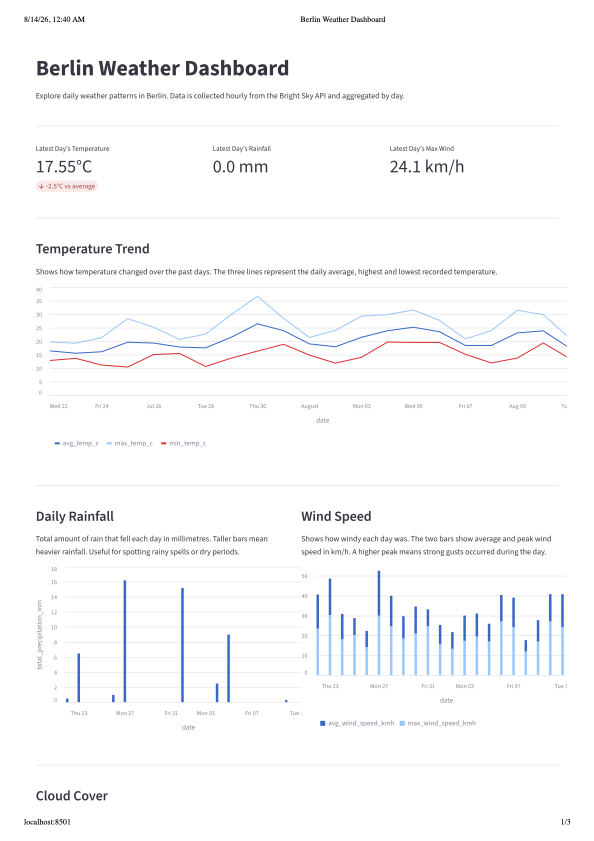

# data-pulse

A generic end-to-end data pipeline framework — ingest from any API, store in DuckDB, transform with dbt, and visualize on a dashboard.

Built as a portfolio project to demonstrate a real-world data engineering stack using open source tools.
## Dashboard Preview



## Live Dashboard

> Coming soon — deploy link will be added after Streamlit Cloud setup

---

## Architecture

```
Bright Sky API
      │
      ▼
  dlt pipeline
  (Python script)
      │
      ▼
DuckDB — landing.weather
      │
      ▼
  dbt models
  ┌─────────────────────────────┐
  │ Bronze → raw copy of data   │
  │ Silver → cleaned & typed    │
  │ Gold   → daily aggregations │
  └─────────────────────────────┘
      │
      ▼
Streamlit Dashboard
```

---

## Tools

| Tool | Purpose |
|---|---|
| **dlt** | Fetches weather data from Bright Sky API and loads it into DuckDB |
| **DuckDB** | Embedded database — stores all raw and transformed data |
| **dbt** | Transforms raw data through Bronze, Silver and Gold layers using SQL |
| **Streamlit** | Interactive dashboard built on top of the Gold table |
| **GitHub Actions** | Schedules the pipeline to run automatically every day |
| **uv** | Python package manager |

---

## Project Structure

```
data-pulse/
  pipelines/
    weather/
      weather_pipeline.py    # fetches data from API, loads into DuckDB
  transforms/
    models/
      bronze/
        bronze_weather.sql   # raw copy of landing data
      silver/
        silver_weather.sql   # cleaned and properly typed
      gold/
        gold_weather_daily.sql # daily aggregations
  dashboard/
    app.py                   # Streamlit dashboard
  .github/
    workflows/
      pipeline.yml           # GitHub Actions daily schedule
```

---

## Local Setup

**1. Install uv**
```bash
curl -LsSf https://astral.sh/uv/install.sh | sh
```

**2. Install dependencies**
```bash
uv sync
```

**3. Run the pipeline**
```bash
uv run python pipelines/weather/weather_pipeline.py
```

**4. Run dbt models**
```bash
cd transforms
uv run dbt run --profiles-dir .
```

**5. Start the dashboard**
```bash
uv run streamlit run dashboard/app.py
```

---

## Data Source

Weather data is sourced from [Bright Sky](https://brightsky.dev) — a free API built on top of open data from the German Weather Service (DWD). Data covers Berlin (52.52°N, 13.405°E).

---

## Known Limitations

- **DuckDB stored in git** — the database file is committed to the repo daily by the pipeline. This works for a portfolio project but will grow over time. [MotherDuck](https://motherduck.com) (hosted DuckDB) is the natural next step for production use.